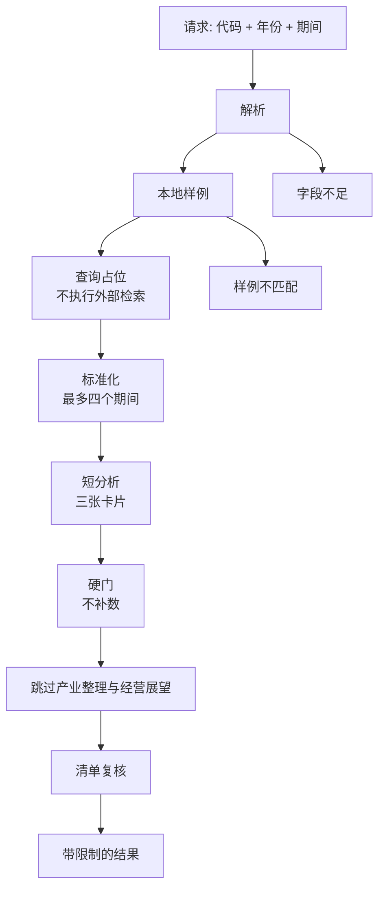

# 审阅版链路

```mermaid
flowchart TD
    A[请求: 代码 + 年份 + 期间] --> B[解析]
    B --> C[本地样例]
    C --> D[查询占位<br/>不执行外部检索]
    D --> E[标准化<br/>最多四个期间]
    E --> F[短分析<br/>三张卡片]
    F --> G[硬门<br/>不补数]
    G --> H[跳过产业整理与经营展望]
    H --> I[清单复核]
    I --> J[带限制的结果]
    B --> X[字段不足]
    C --> Y[样例不匹配]
```

生产质量路径不在这条链上。远程模型即使启用，也只接收短提示词，输出会被截断。
